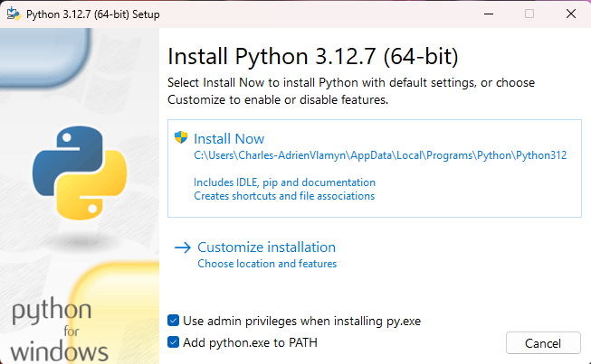
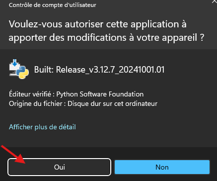
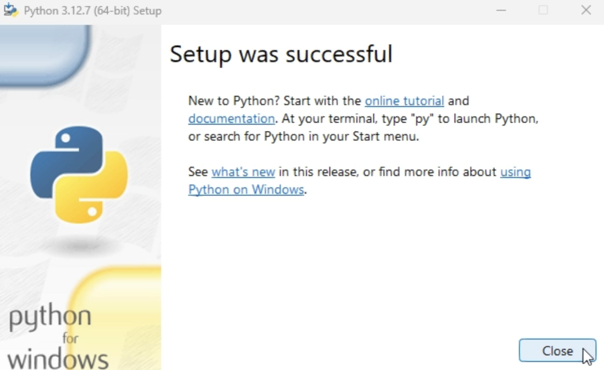
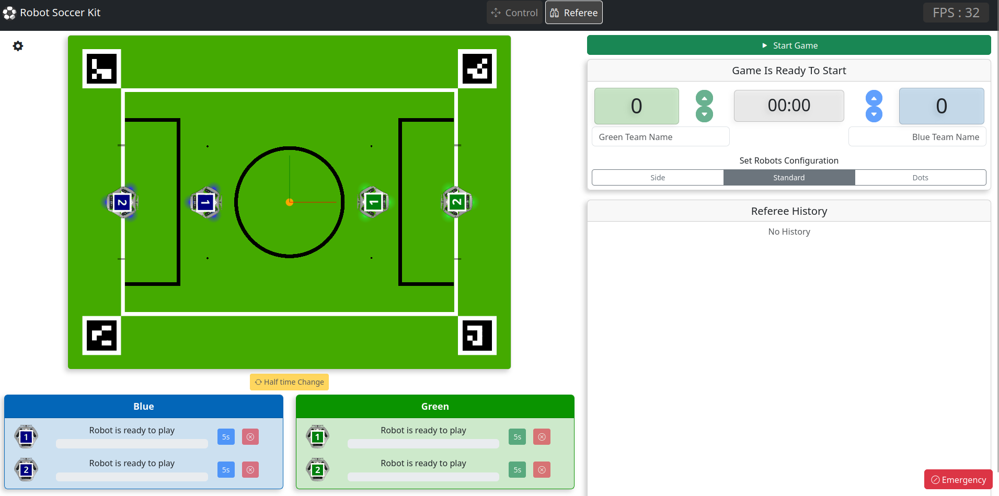

# Atelier Techno-Footballer

Bienvenue dans l'atelier Techno-Footballer ! <br>
Ici tu vas apprendre à jouer au foot avec des robots !


<br>


# Installation

## Prérequis

Si vous utilisez un ordinateur que nous vous avons fourni, veuillez passer directement à l'introduction.

- **Système d'exploitation** : Windows ou Linux
- **Installer Python 3.12.7** : Téléchargez la version appropriée pour votre système depuis le site officiel  [python.org](https://www.python.org/ftp/python/3.12.7/python-3.12.7-amd64.exe).

  <blockquote style="border-left: 5px solid Green; color:Green;">
    <details>
      <summary><span style='font-size:20px;'>&#128248; </span><span style="font-weight: bold; text-decoration: underline;">Procédure d'installation :</span><span style="color:DarkViolet; font-weight: bold;"> Python 3.12.7</span></summary>
      <span></span>
      <span></span>
      <span></span>
    </details>
  </blockquote>
<br>

- **Installer Visual Studio Code avec l'extension Python** : [Téléchargez Visual Studio Code](https://code.visualstudio.com/sha/download?build=stable&os=win32-x64-user) depuis le site officiel. Après l'installation, ouvrez le, accédez à l'onglet des extensions (icône de carré) et recherchez "Python".  [Installez l'extension officielle de Microsoft.](https://marketplace.visualstudio.com/items?itemName=ms-python.python)

    <blockquote style="border-left: 5px solid Green; color:Green;">
        <details>
        <summary><span style='font-size:20px;'>&#128248; </span><span style="font-weight: bold; text-decoration: underline;">Procédure d'installation :</span><span style="color:DarkViolet; font-weight: bold;"> Visual Studio Code</span></summary>
        <span><video src="../assets/Instal_VSCode.mp4" autoplay muted controls alt="aperçu 1"></video></span>
        </details>
    </blockquote>

<br>

- **utiliser Google Chrome** : Téléchargez et installez Google Chrome depuis le site officiel. Définissez-le comme navigateur par défaut.


## Installation du paquet Robot Soccer Kit

Dans un terminal, exécutez la commande suivante :

```bash
pip install robot-soccer-kit[gc]
```

## Lancement

Pour démarrer le contrôleur de jeu, exécutez la commande suivante dans un terminal :

```bash
python -m rsk.game_controller -s
```

<aside>

📒 **Note** : Pour simplifier le lancement, vous pouvez créer un raccourci en fonction de votre système d'exploitation. Sous Windows, par exemple, vous pouvez utiliser un fichier `.bat`, comme illustré dans le dépôt [robot-soccer-kit/getting-started](https://github.com/robot-soccer-kit/getting-started).
</aside>

Après avoir exécuté la commande, la page suivante devrait s'afficher :



## Félicitations tu es prêt !
[Passe à la suite !](./Attaquant.md)